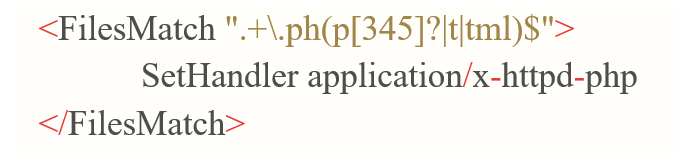

# FileUpload

### Contents
- [Khái niệm FileUpload](https://github.com/chi442000/fileupload#Concept)
- [Nguyên nhân](https://github.com/chi442000/fileupload#reason)
- [Mức độ nguy hiểm ](https://github.com/chi442000/fileupload#dangerousness)
- [Khai thác lỗ hổng](https://github.com/chi442000/fileupload#exploit)
    - [Filter Input](https://github.com/chi442000/fileupload#filter-input)
    - [Header](https://github.com/chi442000/fileupload#header)
    - [Blacklist](https://github.com/chi442000/fileupload#blacklist)
    - [Whitelist](https://github.com/chi442000/fileupload#whitelist)
    - [Check Image](https://github.com/chi442000/fileupload#check-image)
- [Các phòng chống lỗ hổng File Upload](https://github.com/chi442000/SQLi#prevention)

### Concept
- Lỗ hổng File Upload xảy ra khi máy chỉ web cho phép người dùng upload file lên hệ thống mà không xác thực đầy đủ những thứ như tên, loại, nội dung hoặc kích thước của chúng. Khi không có những hạn chế đối với file thì attacker có thể lợi dụng điều đó để thực thi các kịch bản tấn công, thậm chí là thực thi mã từ xa.

- Web shell là một tập lệnh độc hại cho phép attacker thực hiện các lệnh tùy ý trên máy chủ web từ xa chỉ bằng cách gửi các yêu cấp HTTP đến đúng điểm cuối. Nếu có thể upload web shell thành công, bạn có toàn quyền kiểm soát máy chủ.

### Reason
 
Lỗ hổng chạy Script file upload xảy ra khi thỏa mãn những điều kiện sau:

- File upload được lưu vào public directory

- Có thể upload các file script

Đối với uploader, khi tạo ra một ứng dụng phù hợp hai điều kiện trên thì sẽ trở thành nguyên nhân sinh ra lỗ hổng. Vì thế, việc không thỏa mãn ít nhất một trong hai điều kiện nêu trên trở thành đối sách giải quyết của lỗ hổng này.

### Dangerousness

Ảnh hưởng của lỗ hổng file upload phụ thuộc vào hai yếu tố chính:

- Phần của file mà trang web không thể xác định được đúng cách

- Những hạn chế được áp dụng lên file sau khi đã upload thành công

Trường hợp kích thước của tệp nằm ngoài ngưỡng dự kiến có thể kích hoạt tấn công DoS, attacker có thể tấn công lấp đầy không gian đĩa có sẵn.

Trường file được upload không được xác thực đúng cách có thể cho phép attacker ghi đè các tệp quan trọng bằng cách tải lên tệp có cùng tên. Nếu máy chủ cũng dễ bị truy cập thư mục thì attacker có thể upload file vào những vị trí không xác định được.

Trường hợp tệ nhất, loại file không được xác định đúng cách và cấu hình máy chủ cho phép file được thực thi dưới dạng mã (như .php hay .jsp). Trong trường hợp này, attacker có thể upload file có chức năng như một web shell và có thể cho attacker có toàn quyền kiểm soát máy chú.

Tóm lại, lỗ hổng file upload xảy ra có thể:

- Làm lộ các thông tin nội bộ, chẳng hạn như đường dẫn của máy chủ

- Là tiền đề dẫn đến các lỗ hổng khác

- Khiến attacker chiếm quyền điều khiển hệ thống

### Exploit
Đây là một số cách bypass mình đã tìm hiểu được và đã tạo được lab demo
#### **Filter input**
- Không lọc dữ liệu đầu vào (Có thể tải lên bất kì file nào)
  Chúng ta có thể up lên 1 file shell bất kỳ và khai thác trực tiếp. Có một lưu ý đặc biệt đó là file thực thi phải phù hợp với Web server đang sử dụng. Bạn không thể up 1 file .jsp với Apache đúng không? À, có, nhưng nó sẽ không thực thi được. Hãy thử code 1 form upload đơn giản và up shell viết bằng .jsp xem thử đi.
#### Header
- Bypass Check Header
  Đoạn code sử dụng sẽ trông như thế này:
  
Để bypass qua filter này, hãy dùng burp suite sửa content type thành image/...

Ví dụ web cho phép bạn upload file .png, hãy up một cái shell lên, chặn cái request đó lại và sửa:

+Content-type: image/png+
Sau đó forward nó là được
#### Blacklist
- Bypass Check the blacklisted
Blacklist là danh sách những file bị cấm tải lên. Giả sử đoạn code đó sẽ trông như sau:

Bypass qua filter này có thể Upload file có đuôi .php3, .php4, .php5, .pHp, ... Lúc đó tôi đã tự đặt ra câu hỏi là tại sao lại có những số 3 4 5 (ở các tài liệu đọc được), thế 7 8 9 10 thì có được không? Một câu hỏi giúp ta tìm hiểu nhiều hơn, nên tôi sẽ không trả lời nó ở đây.
#### Whitelist
- Bypass Check the whitelisted
Ngược lại với Blacklist thì Whitelist sẽ là danh sách những file được cho phép tải lên. Đây là filter khó bypass nhất

Đúng thế đó. Tôi đã thử nhiểu cách như là sử dụng double extension (Ví dụ như web chỉ cho bạn up file .png thì bạn thêm .png vào file shell, shell.php.png -> shell.png.php), sử dụng null byte (shell.php%00.jpg) nhưng đều không được. Nó có nhiều lý do. Với việc sử dụng code PHP7 thì một số cách bypass kia đã không thể thực hiện được. Nếu bạn tạo lab về lỗ hổng này có thể sử dụng một phiên bản PHP thấp hơn. Tuy nhiên thì tôi vẫn cần nhắc đến việc sử dụng 2 cách này để bypass vì đa số các web vẫn được code bằng PHP5, và có thể bị dính lỗ hổng này.
Một cách khác, đó là cấu hình file .htaccess. Có lẽ đây là cách duy nhất để bypass whitelist với PHP cao cấp
#### Check image
- Bypass check image giả hay thật
Việc xác định định dạng file ngoài việc dựa vào extension, người ta còn dựa vào signature file. Việc xác định signature file sẽ dựa vào 8 bits đầu của file. Code của nó sẽ trông như thế này.

Để bypass qua trường hợp này, hãy thêm một đoạn định dạng vào đầu file shell. Trong trường hợp web upload cho phép upload gif thì thêm GIF89a vào đầu tiên, đánh lừa rằng một file gif đã được tải lên:

### Prevention 

Bất kỳ đầu vào nào đến từ người dùng đều phải được xử lý một cách cẩn thận cho đến khi nó được đảm bảo là an toàn. Điều này đặc biệt đúng với các tệp được tải lên, bởi vì ban đầu ứng dụng của bạn thường coi chúng như một khối dữ liệu vô hại, cho phép kẻ tấn công tiêm bất kỳ loại mã độc hại nào mà chúng muốn vào hệ thống của bạn.
- Tách nội dung tải lên
Các tệp tải lên thường ít được xử lý, trừ khi đang xây dựng một trang web xử lý hình ảnh, video hoặc tài liệu. Nếu đúng như vậy, việc đảm bảo các tệp đã tải lên được giữ riêng biệt với code hệ thống là yếu tố quan trọng nhất. Dùng các dịch vụ lưu trữ đám mây hoặc hệ thống quản lý nội dung để lưu trữ các tệp đã tải lên hoặc cần có khả năng ghi các tệp đã tải lên vào cơ sở dữ liệu của mình. Cả hai cách tiếp cận này đều ngăn chặn việc thực thi ngẫu nhiên script. Việc lưu trữ các tệp đã tải lên trên một máy chủ tệp hoặc trong một phân vùng đĩa riêng biệt cũng có ích, cô lập thiệt hại tiềm ẩn mà một tệp độc hại khả năng gây ra ra.
- Đảm bảo không thể thực thi tệp tải lên
Máy chủ web phải có quyền đọc và ghi trên các thư mục được dùng để lưu trữ nội dung đã tải lên, nhưng không thể thực thi bất kỳ tệp nào ở đó.
- Đổi tên tệp tải lên
Viết lại hoặc làm xáo trộn tên tệp sẽ khiến attacker khó xác định được tệp độc hại sau khi chúng được tải lên và chúng sẽ không thể xác định tên tệp để thực thi file đã upload được. Ngoài ra, cần loại bỏ null byte trong file name.
- Xác thực định dạng tệp và tiện ích mở rộng
Kiểm tra phần mở rộng tệp với danh sách trắng gồm các phần mở rộng được phép thay vì danh sách đen gồm các phần mở rộng bị cấm. Việc đoán những tiện ích mở rộng bạn có thể muốn cho phép dễ dàng hơn nhiều so với việc đoán những tiện ích mở rộng mà kẻ tấn công có thể cố gắng tải lên.
- Xác thực Content-Type
Các tệp được tải lên từ trình duyệt sẽ được kèm theo tiêu đề Content-Type, đảm bảo chúng thuộc white list (mặc khác, hãy lưu ý rằng các tập lệnh hoặc proxy đơn giản khả năng giả mạo loại tệp, vì thế, biện pháp bảo vệ này, mặc dù hữu ích, nhưng không đủ để ngăn cản kẻ tấn công.)
- Dùng trình quét vi-rút
Các trình quét vi-rút rất hữu ích trong việc phát hiện các tệp độc hại giả dạng một loại tệp khác.
- Giới hạn kích thước file tải lên đề phòng DoS như đã nêu ở trên
- Sử dụng một khuôn khổ đã thiết lập để xử lý trước quá trình tải lên tệp thay vì cố gắng viết các cơ chế xác thực của riêng bạn.
- Ép định dạng file

(Shell.php.png -> md5.png)
- Cấu hình apache core giới hạn filename, có bao gồm cả file extension (jpg, png,...)

